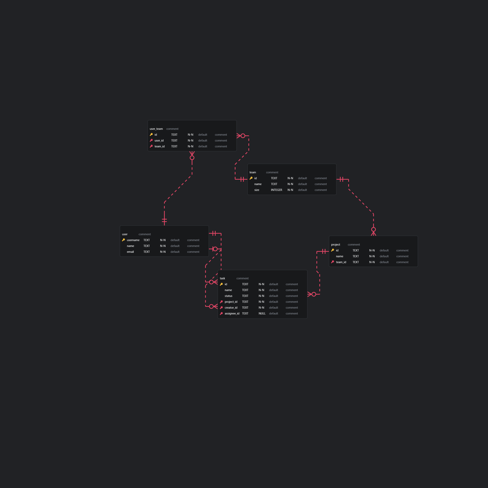

# Project Specification (PROJECT_SPEC.md)

## Problem

> A developer collaboration platform where developers can create team spaces, manage projects, tasks and collaborate with other developers.

## Target users

User —

- Individual developer
- Team member
- Team administrator

## Main capabilities

- Authentication
- Teams
- Team Members
- Projects
- Tasks

# Users and Roles

Team —

- Admin
- Owner
- Member

Owner —

- Delete Team
- Manage Admins

Admin —

- Create Projects
- Manage Members

Member —

- View Projects
- Create Tasks
- Update Assigned Tasks

# User Flow

## Flow 1 — Registration

Open website → Register → Login → Dashboard

## Flow 2 — Create Team Space

Dashboard → Create Team Space → Team Space created → Invite members

## Flow 3 — Create Project

Workspace → Create Project → Project Dashboard → Create Task

## Flow 4 — Complete Task

Task → Assign member → Member works → Update status → Complete

# Data

Elements —

- User
- Team
- Team Member
- Project
- Task

ERD —

ERD v0.0.1

# Tech Stack

Frontend - React (NodeJS)
Backend - FastAPI (Python)
Database - PostgreSQL
